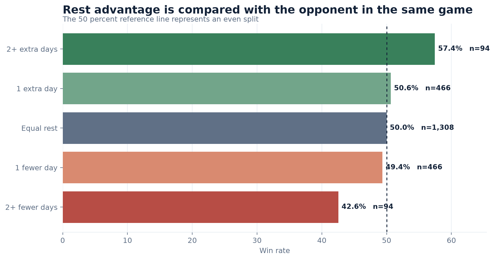
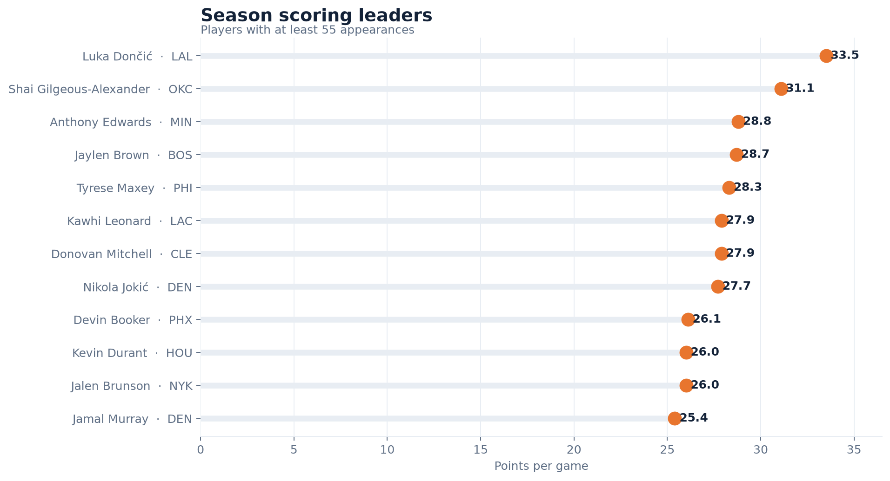
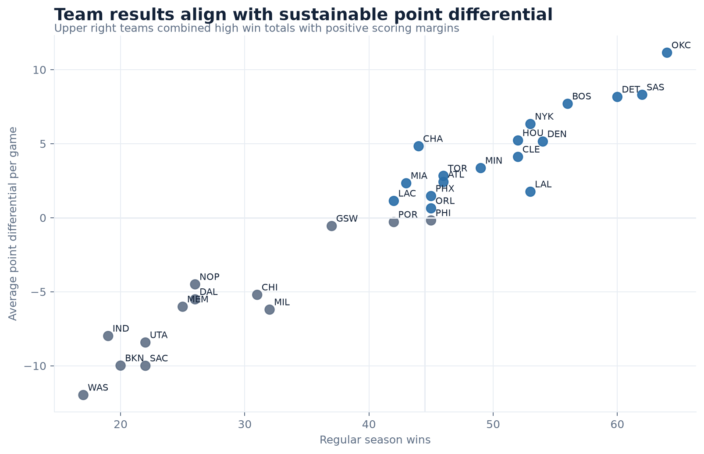

# NBA Basketball Operations Warehouse (2025-26 Season)

A production-style data warehouse that ingests NBA 2025-26 game data daily and
delivers analysis-ready marts answering one business question:

> **"Which players and teams are trending, and how does schedule fatigue
> (rest days, back-to-backs) affect performance — using only data that was
> available before each game?"**

Built the way a real data team builds: testing, data quality, idempotency, and
reconciliation are designed in from the start, not bolted on later.

**[Projects page](https://junyanye33.github.io/nba-basketball-operations-warehouse/)** ·
**[Detailed case study](https://junyanye33.github.io/nba-basketball-operations-warehouse/project.html)**  
Results, charts, architecture, and engineering stories at a glance.

## Results at a glance

Complete 2025 to 2026 regular season coverage:

**1,230 games &middot; 26,651 player game rows &middot; 582 players &middot;
164 of 164 game dates reconciled &middot; 18 automated tests**

Teams with at least two more rest days than their opponent won **57.4 percent**
of games. Teams with at least two fewer rest days won **42.6 percent**.







Charts regenerate from the warehouse with `python scripts/build_showcase.py`.

## Architecture

```
NBA Stats API ──> Bronze (raw JSON + manifest/sha256, immutable, replayable)
                    │
                    ▼
                  Silver (PostgreSQL: typed, validated, UPSERT-idempotent,
                          quarantine table for bad rows, Alembic migrations)
                    │
                    ▼
                  Gold (DuckDB: facts + leakage-safe rolling marts)
                    │
                    ▼
                  Quality reports (bronze-vs-silver reconciliation, JSON)
```

Why medallion layers: raw snapshots make every load replayable and auditable;
the relational silver layer enforces keys and types; the columnar gold layer
serves analytical queries with window functions cheaply.

## Quick start (zero setup, no network)

```bash
pip install -r requirements.txt
pip install -e .
python -m nba_warehouse.cli smoke   # end-to-end run on recorded fixtures
pytest                              # unit + integration + data-quality tests
```

The smoke run lands recorded API payloads in bronze, loads silver (SQLite in
smoke mode), builds the DuckDB gold marts, and writes reconciliation reports
to `data/smoke/reports/`.

## Live mode (PostgreSQL + NBA Stats API)

```bash
docker compose up -d postgres
cp .env.example .env
alembic upgrade head                                  # versioned schema migrations
python -m nba_warehouse.cli run-date --date 2026-01-10
python -m nba_warehouse.cli replay --start-date 2026-01-10 --end-date 2026-01-17
python -m nba_warehouse.cli run-season
python -m nba_warehouse.cli reconcile --date 2026-01-10
```

`run-season` uses two source requests, one for player logs and one for team
logs. It partitions both responses into daily Bronze snapshots, loads and
reconciles every game date, then builds Gold once.

## Data quality guarantees

| Guarantee | How |
|---|---|
| Nothing dropped silently | Invalid rows go to `rejected_record` with a reason |
| Every raw row accounted for | Reconciliation: bronze counts = silver + quarantined |
| Safe replays / backfills | Natural-key UPSERTs; re-running a date changes nothing |
| No target leakage | Rolling marts use `ROWS BETWEEN 10 PRECEDING AND 1 PRECEDING` |
| Auditability | Bronze manifest with sha256 checksums; `pipeline_run` audit table |

## Gold marts

- `mart_player_form` — each player's rolling form (points/minutes/reb/ast over
  prior 10 games) *entering* each game.
- `mart_team_schedule_context` — days of rest and back-to-back flags per team-game.
- `mart_data_completeness` — per-date completeness status (2 team rows per game).

## Repository layout

```
src/nba_warehouse/
  extract/    NBA Stats API client (retry/backoff, headers)
  bronze/     raw snapshot writer + manifest with checksums
  silver/     SQLAlchemy schema, parser + validation, idempotent loader
  gold/       DuckDB fact/mart builder
  quality/    bronze-vs-silver reconciliation
  pipeline.py orchestration (ingest -> load -> transform -> reconcile)
  cli.py      command-line entry points
migrations/   Alembic (versioned schema changes)
tests/        unit / integration / data_quality suites + recorded fixtures
docs/         charter, architecture, data model, runbook
```

## Docs

- [Project charter](docs/charter.md) — business problem, users, scope, success criteria
- [Data model](docs/data_model.md) — grain, keys, indexes
- [Runbook](docs/runbook.md) — daily operations, failure handling, backfills
